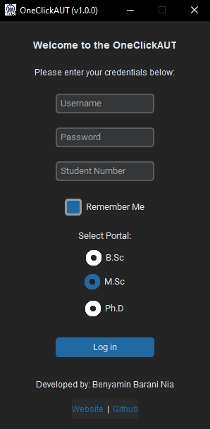

# OneClickAUT

  

**OneClickAUT** is a Python-based application designed to simplify and automate the process of accessing the [Amirkabir University of Technology (AUT) Student Portal](https://accounts.aut.ac.ir/cas/login). It allows students to log in to their B.Sc, M.Sc, or Ph.D portals with just one click, eliminating the need for repetitive manual steps.

---

## Features
- **Easy Login**: Automates the login process for AUT's Student Portal.
- **Degree Selection**: Supports B.Sc, M.Sc, and Ph.D portals.
- **Remember Me**: Saves your credentials for future use (optional).
- **Secure**: Encrypts sensitive data like passwords.
- **User-Friendly Interface**: Simple and intuitive GUI built with `customtkinter`.
- **Cross-Platform**: Works on Windows (tested on Window 10).

⚡️You can also download the standalone .exe file of the app, which includes all dependencies and can be run on Windows 10/11. [Download](https://drive.google.com/file/d/1ZVVbYC3TmRG7fnpxVH21iTL8oruJ-YX5/view?usp=sharing)⚡️

---

## Screenshots
  
*Main Interface of OneClickAUT v1.0.0*

---

## Installation
### Prerequisites
- **Python 3.13+**: Download and install Python from [python.org](https://www.python.org/).
- **Google Chrome**: Ensure Google Chrome is installed on your system.
- **ChromeDriver**: Download the appropriate version of ChromeDriver from [here](https://googlechromelabs.github.io/chrome-for-testing/).

⚠️Download the version of ChromeDriver that matches your installed Google Chrome version⚠️

⚡️You can also download the standalone .exe file of the app, which includes all dependencies and can be run on Windows 10/11. [Download](https://drive.google.com/file/d/1ZVVbYC3TmRG7fnpxVH21iTL8oruJ-YX5/view?usp=sharing)⚡️

---

### Steps
1. Clone the repository:
   ```bash
   git clone https://github.com/BenyaminBaraniNia/OneClickAUT
   cd OneClickAUT
2. Install the required Python packages:
   ```bash
   pip install -r requirements.txt
3. Download the version of ChromeDriver that matches your installed Google Chrome version.

4. Run the application:
   ```bash
   python OneClickAUT.py

---

### Usage
1. **Launch the Application**: Run the script, and the OneClickAUT GUI will appear.

2. **Enter Credentials**: 
- Input your AUT Student ID and Password.
- Optionally, enable the "Remember Me" feature to save your credentials securely.

3. **Select Degree**: Choose your degree level (B.Sc, M.Sc, or Ph.D) from the dropdown menu.

4. **Click Login**: The application will automatically log you into the corresponding student portal.

---

### Security
- **Encryption**: Passwords are encrypted using AES-256 encryption before being stored locally.
- **No Data Sharing:** Your credentials are never shared or transmitted outside your local machine.

---

### Contributing
Contributions are welcome! If you'd like to contribute to OneClickAUT, please follow these steps:
1. Fork the repository.
2. Create a new branch for your feature or bugfix.
3. Commit your changes and push to your branch.
4. Submit a pull request with a detailed description of your changes.

---

### License
This project is licensed under the MIT License. See the LICENSE file for details.

---

### Acknowledgments
- **Selenium**: For automating the browser interaction.
- **customtkinter**: For the modern and customizable GUI.
- **Cryptography**: For secure password encryption.
- **DeepSeek**: For assisting with code optimization, debugging, and documentation.
- **ChatGPT**: For providing AI-powered insights and support.

---

### Contact
For questions or feedback, feel free to reach out:

- **Email**: [Benyamin.Barani.Nia@Gmail.com](Benyamin.Barani.Nia@Gmail.com)
- **Github**: [https://github.com/BenyaminBaraniNia](https://github.com/BenyaminBaraniNia)
- **Website**: [https://www.BenWrites.ir/](https://www.benwrites.ir/)

---

### Support the Project
If you find this project useful, consider giving it a ⭐️ on GitHub!

---
Enjoy seamless access to your AUT Student Portal with OneClickAUT! 🚀